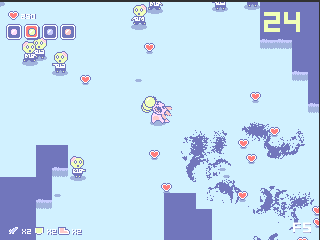
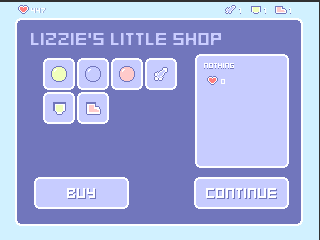

# I've Got A Second Chance At Life But Now I'm An Axolotl And In Massive Debt

This is a repository for the game I've Got A Second Chance At Life But Now I'm An Axolotl And In Massive Debt (IGASCALBNIAAAIMD), a top-down shooter made in 72 hours for the Ludum Dare 44 Jam by **Andreas Sturmer** (remruts).

The game is made in Unity 2017.3.0f3 and is currently **unfinished**. It also has several bugs and the UI is broken for some resolutions.

As long as it's credited somewhere, you may use the code and other assets **except the music**. The music was made by Patrick Sturmer and if you'd like to use it you should contact him.  
The pathfinding scripts were made following **[this video tutorial playlist](https://www.youtube.com/watch?v=-L-WgKMFuhE&list=PLFt_AvWsXl0cq5Umv3pMC9SPnKjfp9eGW)** and the LowRes.cs was found  **[here](https://answers.unity.com/questions/1459816/setting-unity-to-run-at-fullscreen-320240-resoluti.html)** but I didn't have the time to use it. Also, the fonts are made by **[Kenney](https://kenney.nl/assets)**

Although TextMesh Pro isn't of my authorship, I believe it comes in the newer versions of Unity, so there shouldn't be any problems with licenses and such.

#### Builds
For Windows, Mac and Linux can be found at [https://remruts.itch.io/igascalbniaaaimd](https://remruts.itch.io/igascalbniaaaimd)

